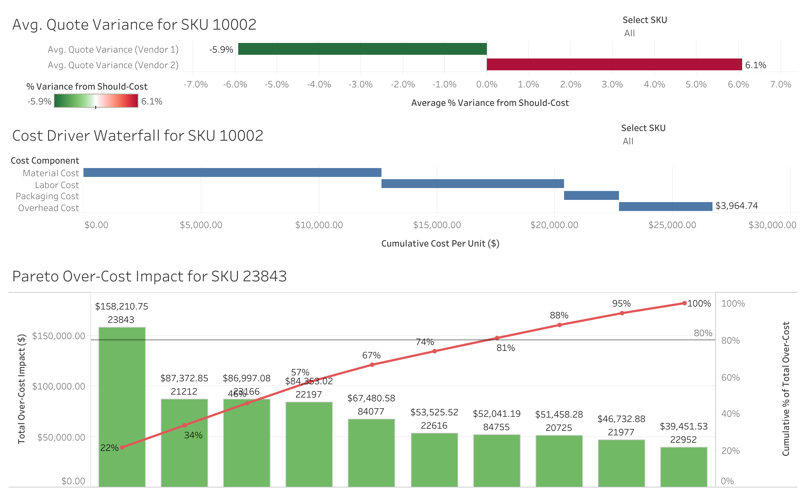

# Retail Data Cost Analysis

This repository showcases a retail cost analysis workflow using the UCI Online Retail dataset. It combines a Python data processing script with an embedded Tableau dashboard to provide insights into product and vendor cost metrics.

## Project Structure

* **process\_retail\_data.py**
  A Python script that:

  1. Loads and cleans the raw `Online_Retail.xlsx` dataset.
  2. Standardizes records and handles missing or inconsistent entries.
  3. Calculates key cost metrics (e.g., modeled “should‑cost” vs. vendor quotes).
  4. Outputs the transformed data as `Processed_Retail_Data.csv`.

* **Online\_Retail.xlsx**
  The original UCI Online Retail transactions dataset, containing order-level details for product purchases.

* **Processed\_Retail\_Data.csv**
  The cleaned and enriched CSV featuring aggregated cost calculations and data quality checks.

## Tableau Dashboard

What it shows:

* **Average Quote Variance:** For each SKU, this bar chart depicts the percentage difference between each vendor’s quoted price and the modeled should‑cost. It highlights where vendor quotes exceed or fall below cost estimates—allowing the user to prioritize negotiation or alternative sourcing for maximum savings.

* **Cost Driver Waterfall:** This waterfall chart breaks down a selected SKU’s total cost into component steps—starting from the base should‑cost and then adding material, labor, packaging, and overhead. It clarifies which cost elements drive expenses, guiding targeted cost‑reduction efforts.

* **Pareto Over‑Cost Impact:** A Pareto chart of the top 10 SKUs ranked by their total dollar over‑cost (vendor quote minus should‑cost), with a cumulative line illustrating each SKU’s share of excess spend. This view applies the 80/20 principle to pinpoint the few SKUs that account for the majority of cost overruns.

`MyTableauDashboard.twbx` – packaged Tableau workbook

View the fully interactive dashboard here:
https://emma-lewis.github.io/Retail_Data/

## Summary

A reproducible workflow that:

1. **Cleans and transforms** raw retail transaction data using Python.
2. **Calculates actionable cost insights**, comparing vendor quotes against modeled should‑costs.
3. **Visualizes** results in an interactive Tableau dashboard embedded above.

## Data Citation

Chen, D. (2015). *Online Retail* [Dataset]. UCI Machine Learning Repository. https://doi.org/10.24432/C5BW33.
